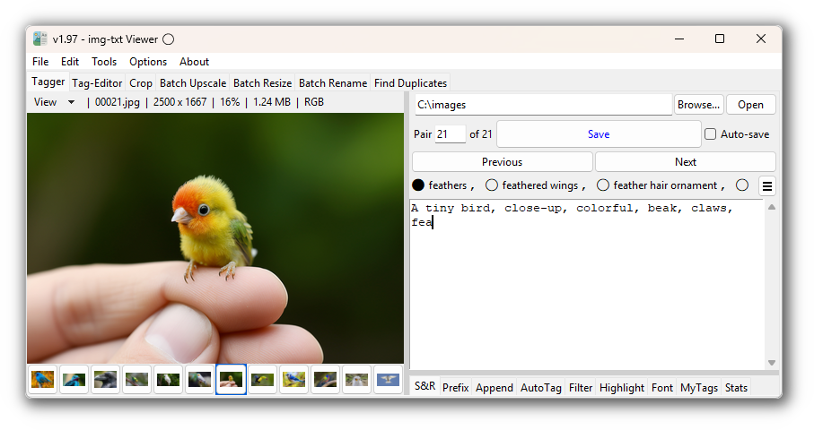

<!-- markdownlint-disable MD033 MD029 -->

#  img-txt_viewer

img-txt_viewer is a Windows application for side-by-side image and text viewing,
designed to streamline manual captioning or tagging of images. The toolset
specifically targets LoRA dataset preparation.




---

- [📝 Usage](#-usage)
- [💡 Features](#-features)
- [🛠️ Install](#-install)
- [🔒 Privacy Policy](#-privacy-policy)
- [📜 Version History](https://github.com/Nenotriple/img-txt_viewer/blob/main/docs/Changelog.md)
- [✨ User Guide](https://github.com/Nenotriple/img-txt_viewer/blob/main/docs/User_Guide.md)
- [💾 Download](https://github.com/Nenotriple/img-txt_viewer/releases?q=executable&expanded=true)

---

## 📝 Usage

- ✅ **Do this:** Ensure image-text pairs share the same basename.
  - Example: `01.png, 01.txt`, `02.jpg, 02.txt`, etc.

- ❌ **Don't do this:** Avoid different filetypes with the same basename.
  - Example: `01.png, 01.txt`, `01.jpg, 01.txt` (causes text file collision).

**Supported formats:**
`.png`, `.jpg`, `.jpeg`, `.jfif`, `.jpg_large`, `.webp`, `.bmp`, `.gif`, `.mp4`

### Select Alt Text Path

Images and text files can be loaded from different folders.

<details>
<summary>Click to expand...</summary>

---

By default, text files are loaded from the selected directory. To load text files
from a different path:

1. Select a directory as usual.
2. Right-click the `Browse...` button and choose **Set Text File Path**.
3. When an alternate path is chosen, a blue indicator appears to the left of the
   directory entry. Hover over the indicator to view the selected text path.

**Example folder structures:**

#### Images and text files in same folder

```text
.
└── dataset/
    ├── 01.png
    ├── 01.txt
    ├── 02.jpg
    └── 02.txt
```

#### Images and text files in separate folders

```text
.
└── dataset/
    ├── images/
    │   ├── 01.png
    │   └── 02.jpg
    └── captions/
        ├── 01.txt
        └── 02.txt
```

</details>

---

## 💡 Features

For details, see the [User Guide ✨](https://github.com/Nenotriple/img-txt_viewer/blob/main/docs/User_Guide.md)
or use the links below.

### Tagger Shortcuts

- [ALT+LEFT/RIGHT](docs/User_Guide.md#altleftright) – Navigate image-text pairs
- [SHIFT+DEL](docs/User_Guide.md#shiftdel) – Move pair to trash
- [ALT](docs/User_Guide.md#alt) – Cycle autocomplete suggestions
- [TAB](docs/User_Guide.md#tab) – Insert highlighted suggestion
- [CTRL+S](docs/User_Guide.md#ctrls) – Save text file
- [CTRL+E](docs/User_Guide.md#ctrle) – Next empty text file
- [CTRL+R](docs/User_Guide.md#ctrlr) – Random image-text pair
- [CTRL+F](docs/User_Guide.md#ctrlf) – Find and Replace
- [CTRL+Z / CTRL+Y](docs/User_Guide.md#ctrlz--ctrly) – Undo / Redo
- [CTRL+W](docs/User_Guide.md#ctrlw) – Close app
- [F1](docs/User_Guide.md#f1) – Toggle image grid
- [F2](docs/User_Guide.md#f2) – Toggle zoom popup
- [F4](docs/User_Guide.md#f4) – Open in image editor
- [Middle-click](docs/User_Guide.md#middle-click) – Delete tag

### Tagger Toolbar

- [Search and Replace (S&R)](docs/User_Guide.md#search-and-replace)
- [Prefix](docs/User_Guide.md#prefix)
- [Append](docs/User_Guide.md#append)
- [AutoTag](docs/User_Guide.md#autotag)
- [Filter](docs/User_Guide.md#filter)
- [Highlight](docs/User_Guide.md#highlight)
- [Font](docs/User_Guide.md#font)
- [My Tags](docs/User_Guide.md#my-tags)
- [Stats](docs/User_Guide.md#stats)

### Main Toolbar

- [Tag-Editor](docs/User_Guide.md#tag-editor)
- [Crop](docs/User_Guide.md#crop)
- [Batch Upscale](docs/User_Guide.md#batch-upscale)
- [Batch Resize](docs/User_Guide.md#batch-resize)
- [Batch Rename](docs/User_Guide.md#batch-rename)
- [Find Duplicates](docs/User_Guide.md#find-duplicates)

### Menubar

- **File Menu**
  - [Select Directory](docs/User_Guide.md#select-directory)
  - [Open Current Directory](docs/User_Guide.md#open-current-directory)
  - [Refresh Files](docs/User_Guide.md#refresh-files)
  - [Open Current Image](docs/User_Guide.md#open-current-image)
  - [Open Text File](docs/User_Guide.md#open-text-file)
  - [Edit Image](docs/User_Guide.md#edit-image)
  - [Zip Dataset](docs/User_Guide.md#zip-dataset)
  - [Exit](docs/User_Guide.md#exit)
- **Edit Menu**
  - [Save Text](docs/User_Guide.md#save-text)
  - [Cleanup All Text Files](docs/User_Guide.md#cleanup-all-text-files)
  - [Create Blank Text Files](docs/User_Guide.md#create-blank-text-files)
  - [Rename Pair](docs/User_Guide.md#rename-pair)
  - [Duplicate Pair](docs/User_Guide.md#duplicate-pair)
  - [Delete Pair](docs/User_Guide.md#delete-pair)
  - [Undo Delete](docs/User_Guide.md#undo-delete)
  - [Next Empty Text File](docs/User_Guide.md#next-empty-text-file)
  - [Random File](docs/User_Guide.md#random-file)
  - [Open Settings File](docs/User_Guide.md#open-settings-file)
  - [Open MyTags File](docs/User_Guide.md#open-mytags-file)
- **Tools Menu**
  - [Batch Operations](docs/User_Guide.md#batch-operations)
    - [Batch Crop Images](docs/User_Guide.md#batch-crop-images)
    - [Create Wildcard From Captions](docs/User_Guide.md#create-wildcard-from-captions)
  - [Edit Current Pair](docs/User_Guide.md#edit-current-pair)
    - [Upscale](docs/User_Guide.md#batch-upscale)
    - [Crop](docs/User_Guide.md#_crop)
    - [Resize](docs/User_Guide.md#resize)
    - [Expand](docs/User_Guide.md#expand)
    - [Rotate](docs/User_Guide.md#rotate)
    - [Flip](docs/User_Guide.md#flip)
    - [Auto-Tag](docs/User_Guide.md#auto-tag)
- **Options Menu**
  - [Text Options](docs/User_Guide.md#text-options)
    - [Clean Text](docs/User_Guide.md#clean-text)
    - [Auto-Delete Blank Files](docs/User_Guide.md#auto-delete-blank-files)
    - [Highlight Selection](docs/User_Guide.md#highlight-selection)
    - [Add Comma After Tag](docs/User_Guide.md#add-comma-after-tag)
    - [List View](docs/User_Guide.md#list-view)
    - [Auto-Save](docs/User_Guide.md#auto-save)
  - [Loading Order](docs/User_Guide.md#loading-order)
  - [Autocomplete](docs/User_Guide.md#autocomplete)
    - [Dictionary](docs/User_Guide.md#autocomplete-dictionary)
    - [Threshold](docs/User_Guide.md#autocomplete-threshold)
    - [Quantity](docs/User_Guide.md#autocomplete-quantity)
    - [Match Mode](docs/User_Guide.md#autocomplete-match-mode)
  - [Set Default External Editor](docs/User_Guide.md#set-default-external-editor)
  - [Restore Last Path](docs/User_Guide.md#restore-last-path)
  - [Reset Settings](docs/User_Guide.md#reset-settings)
- [About Menu](docs/User_Guide.md#about-menu)

### Tagger View Menu

- [Toggle Image Grid](docs/User_Guide.md#toggle-image-grid)
- [Toggle Zoom](docs/User_Guide.md#toggle-zoom)
- [Toggle Thumbnail Panel](docs/User_Guide.md#toggle-thumbnail-panel)
- [Toggle Edit Panel](docs/User_Guide.md#toggle-edit-panel)
- [Always On Top](docs/User_Guide.md#always-on-top)
- [Big Save Button](docs/User_Guide.md#big-save-button)
- [UI: Vertical View](docs/User_Guide.md#ui-vertical-view)
- [UI: Swap img-txt Sides](docs/User_Guide.md#ui-swap-img-txt-sides)

---

## 🛠 Install

### Portable Setup


1. Download the Windows executable from the
   [releases page](https://github.com/Nenotriple/img-txt_viewer/releases?q=executable&expanded=true).
2. Run the executable to launch the app.

### Python Package Setup


1. Download the source code package from the latest
   [releases page](https://github.com/Nenotriple/img-txt_viewer/releases?q=executable&expanded=true).
2. Run the `Start.bat` file to automatically create and activate a virtual environment,
   then launch the app.
3. Use `Start.bat` to launch the app in the future.

<details>
<summary>Manual Python Setup...</summary>

---


1. **Clone the repository:**

   ```bash
   git clone https://github.com/Nenotriple/img-txt_viewer.git
   ```

2. **Navigate into the project directory:**

   ```bash
   cd img-txt_viewer/img-txt_viewer
   ```

3. **Create and activate a virtual environment:**

   ```bash
   python -m venv venv
   venv\Scripts\activate
   ```

4. **Install the required dependencies:**

   ```bash
   pip install -r requirements.txt
   ```

5. **Launch the app:**

   ```bash
   python app.py
   ```

</details>

---

## 🔒 Privacy Policy

**img-txt Viewer** is completely private.

- The app operates entirely on your device; your data remains under your control.
- **No data is collected, transmitted, or stored** except for a basic local config file for app settings.
- The app functions 100% offline and never connects to external servers.
  **No data is ever shared or sent elsewhere.**
